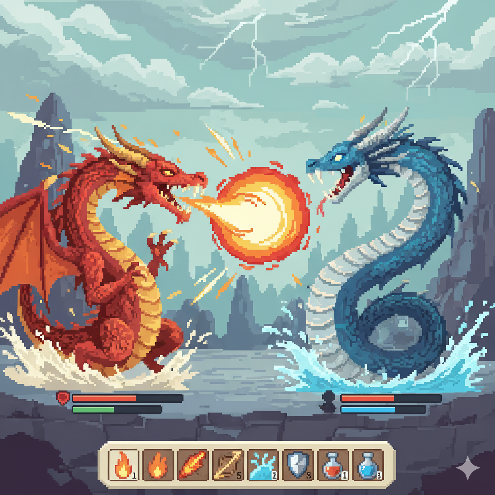
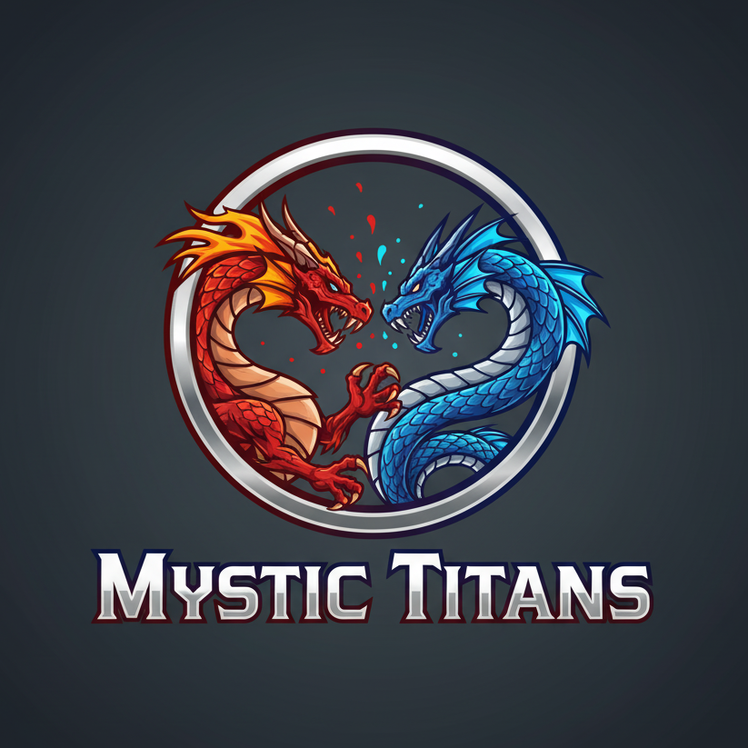
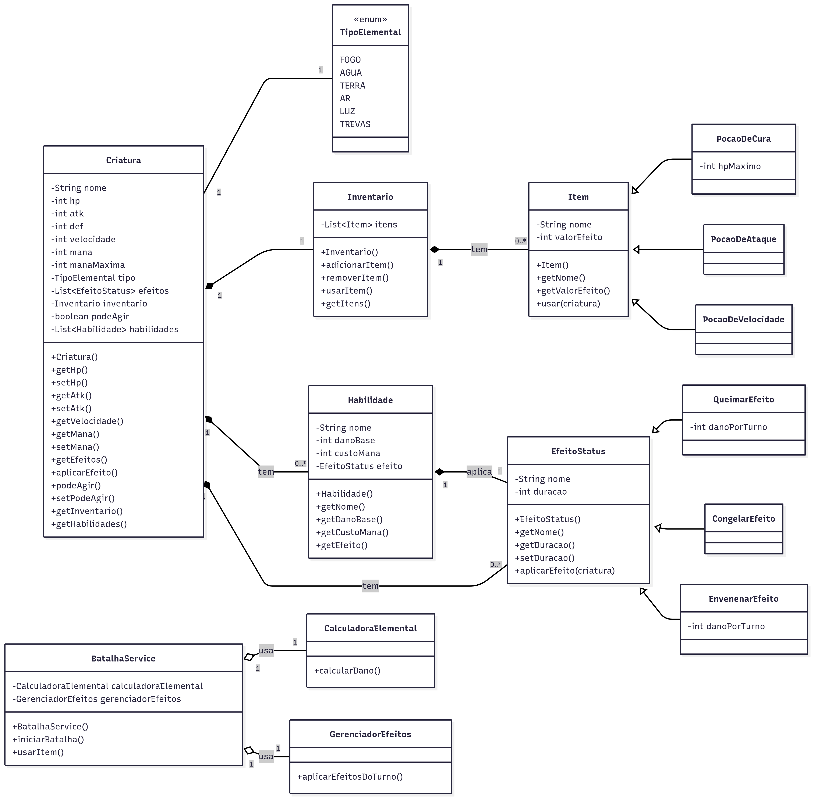

<div align="center">
  
</div>

# 🐉 Mystic Titans

<div align="center">


</div>

## 🌟 Apresentação do Jogo

Nome do Jogo: Mystic Titans

Slogan: A Batalha dos Elementos Te Espera.

## Logotipo

<div align="center" style="border-radius: 10px;">
  
</div>

**Principais Características:**
- Sistema de batalha completo em **Java**
- Arquitetura em camadas (`model` e `service`)
- Sistema de vantagem/desvantagem elemental
- Aplicação de efeitos de status com duração
- Testes unitários com **JUnit** e **Mockito**

## 🚀 Funcionalidades Principais

<div align="center">

| Funcionalidade | Descrição | Status |
|---|---|---|
| 🐉 **Sistema de Criaturas** | Cada criatura possui atributos e tipo elemental. | ✅ |
| 🔥💧🍃 **Vantagem Elemental** | Regras de dano baseadas em tipos elementais. | ✅ |
| 🛡️ **Sistema de Batalha** | Lógica de batalha por turnos com iniciativa por velocidade. | ✅ |
| 🧪 **Efeitos de Status** | Efeitos como "Queimado" e "Congelado" com duração. | ✅ |
| 📦 **Sistema de Inventário** | Gerenciamento de itens usáveis durante a batalha. | ✅ |
| 🧪✅ **Testes Unitários** | Validação da lógica com JUnit e Mockito. | ✅ |

</div>

## 🔧 Stack Tecnológica

### Backend

Java 17+
├── Maven
├── JUnit 5
├── Mockito

## 📂 Estrutura do Projeto

Este projeto segue uma estrutura de diretórios padrão Maven, com as classes de produção localizadas em src/main e os testes em src/test. Abaixo, você encontra a organização detalhada dos pacotes e classes.

````
gestao-espaco-fisico/
│
├── 📁 src/
│   ├── 📁 main/
│   │   ├── 📁 java/com/parceirodeprogramacao/
│   │   │   ├── 📁 model/                  # Classes de dados
│   │   │   │   ├── 📄 Criatura.java
│   │   │   │   ├── 📄 Habilidade.java
│   │   │   │   ├── 📄 Inventario.java
│   │   │   │   ├── 📄 Item.java
│   │   │   │   ├── 📄 TipoElemental.java
│   │   │   │   ├── 📄 CongelarEfeito.java
│   │   │   │   ├── 📄 EnvenenarEfeito.java
│   │   │   │   └── 📄 QueimarEfeito.java
│   │   │   │
│   │   │   ├── 📁 service/                # Lógica de negócio
│   │   │   │   ├── 📄 BatalhaService.java
│   │   │   │   ├── 📄 CalculadoraElemental.java
│   │   │   │   └── 📄 GerenciadorEfeitos.java
│   │   │   │
│   │   │   └── 📄 Main.java
│   │   └── 📁 resources/
│   │
│   └── 📁 test/
│       └── 📁 java/com/parceirodeprogramacao/
│           └── 📁 test/                   # Testes unitários
│               ├── 📄 BatalhaServiceTest.java
│               ├── 📄 CalculadoraElementalTest.java
│               ├── 📄 CriaturaTest.java
│               └── 📄 GerenciadorEfeitosTest.java
│
└── 📄 pom.xml                             # Dependências Maven
````

Principais Pontos:

- src/main/java: Contém o código-fonte principal da aplicação.

- model: Pacote para as classes de dados e entidades do jogo.

- service: Pacote para a lógica de negócio, como a simulação da batalha.

- Main.java: Ponto de entrada da aplicação.

- src/test/java: Contém os testes unitários e de integração para garantir a qualidade do código.

- pom.xml: Arquivo de configuração do Maven, onde estão listadas as dependências do projeto.

## 📚 Diagramas de Arquitetura

Aqui estão os diagramas de classe e sequência que visualizam a estrutura e o fluxo do projeto.

### Diagrama de Classe (Estrutura Estática)

<div align="center">
  
</div>

### Diagrama de Sequência

<div align="center">
  
</div>


## 🛠️ Como Executar os Testes

Para executar os testes unitários do projeto, basta ter o **Maven** e o **JUnit 5** configurados. Você pode rodar todos os testes a partir da linha de comando com o seguinte comando:

```bash
mvn test
Ou, se estiver usando um IDE como o IntelliJ IDEA, clique com o botão direito na pasta src/test/java e selecione Run 'All Tests'.

🤝 Como Contribuir
Contribuições são muito bem-vindas! Se você tiver uma ideia para melhorar o jogo, sinta-se à vontade para abrir uma Issue ou um Pull Request.

📄 Licença
<div align="center">

Este projeto está sob a licença MIT. Veja o arquivo LICENSE para mais detalhes.

</div>
