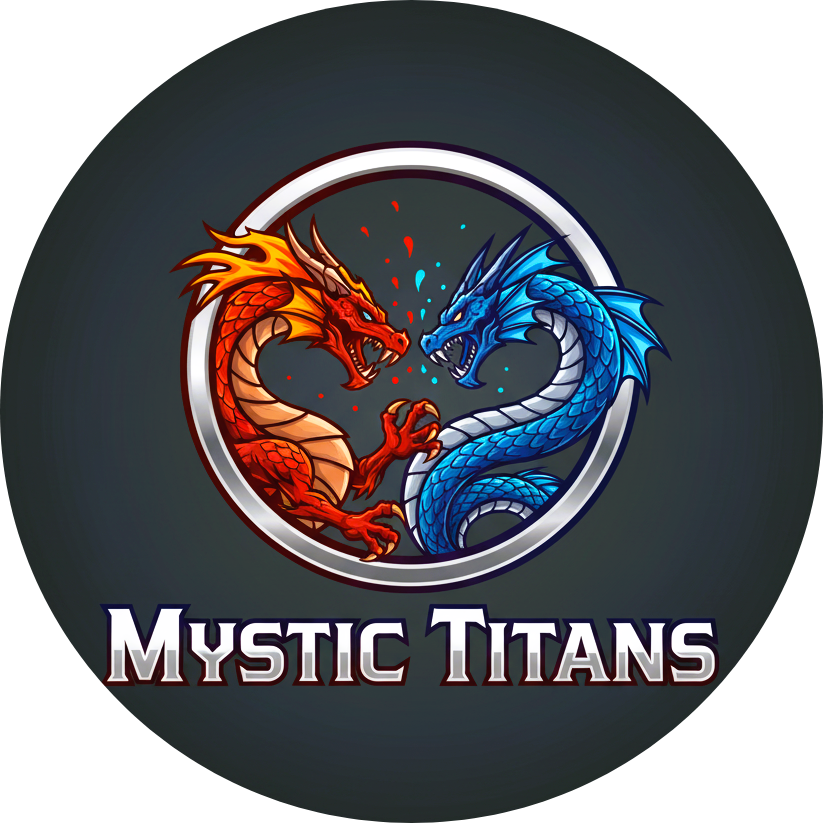

<div align="center">
  
</div>

# 🐉 Mystic Titans

<div align="center">


</div>

## 🌟 Apresentação do Jogo

**Nome do Jogo:** Mystic Titans

**Slogan:** A Batalha dos Elementos Te Espera.

## Logotipo

<div align="center" style="border-radius: 10px;">
  
</div>

**Principais Características:**
- Sistema de batalha completo em **Java**
- Arquitetura em camadas (`model` e `service`)
- Sistema de vantagem/desvantagem elemental
- Aplicação de efeitos de status com duração
- Testes unitários com **JUnit** e **Mockito**

---

## 📖 Contexto do Jogo

O universo de Mystic Titans é um reino antigo, onde o equilíbrio entre os seis elementos primordiais foi quebrado. Como um **Guardião Elemental**, sua missão é capturar e treinar essas criaturas, forjando laços de amizade e estratégia para restaurar a ordem.

As batalhas de criaturas místicas são fascinantes por combinarem estratégia e imaginação. O jogador não apenas ataca, mas deve pensar nas vantagens elementais, nos efeitos de status e na iniciativa, o que adiciona uma profundidade tática que prende a atenção.

---

## 🎯 Público-Alvo

Mystic Titans foi criado para:

* **Fãs de RPG e Estratégia:** Pessoas que gostam de jogos de batalha por turnos e buscam uma camada extra de profundidade.
* **Jogadores Táticos:** Aqueles que se divertem planejando, pensando à frente e descobrindo as melhores combinações de habilidades e tipos.
* **Apreciadores de Universos de Fantasia:** Jogadores que se interessam por mundos ricos em histórias e criaturas místicas.

---
## 🚀 Funcionalidades Principais

<div align="center">

| Funcionalidade | Descrição | Status |
|---|---|---|
| 🐉 **Sistema de Criaturas** | Cada criatura possui atributos e tipo elemental. | ✅ |
| 🔥💧🍃 **Vantagem Elemental** | Regras de dano baseadas em tipos elementais. | ✅ |
| 🛡️ **Sistema de Batalha** | Lógica de batalha por turnos com iniciativa por velocidade. | ✅ |
| 🧪 **Efeitos de Status** | Efeitos como "Queimado" e "Congelado" com duração. | ✅ |
| 📦 **Sistema de Inventário** | Gerenciamento de itens usáveis durante a batalha. | ✅ |
| 🧪✅ **Testes Unitários** | Validação da lógica com JUnit e Mockito. | ✅ |

</div>

## 🔧 Stack Tecnológica

### Backend

Java 17+
├── Maven
├── JUnit 5
├── Mockito

## 📂 Estrutura do Projeto

Este projeto segue uma estrutura de diretórios padrão Maven, com as classes de produção localizadas em src/main e os testes em src/test. Abaixo, você encontra a organização detalhada dos pacotes e classes.

````
gestao-espaco-fisico/
│
├── 📁 src/
│   ├── 📁 main/
│   │   ├── 📁 java/com/parceirodeprogramacao/
│   │   │   ├── 📁 model/                  # Classes de dados
│   │   │   │ ├── 📄 Botas.java
│   │   │   │   ├── 📄 CongelarEfeito.java
│   │   │   │   ├── 📄 Criatura.java
│   │   │   │   ├── 📄 EfeitoStatus.java
│   │   │   │   ├── 📄 EnvenenarEfeito.java
│   │   │   │   ├── 📄 Habilidade.java
│   │   │   │   ├── 📄 Inventario.java
│   │   │   │   ├── 📄 Item.java
│   │   │   │   ├── 📄 PocaoDeAtaque.java
│   │   │   │   ├── 📄 PocaoDeCura.java
│   │   │   │   ├── 📄 QueimarEfeito.java
│   │   │   │   ├── 📄 TipoElemental.java
│   │   │   │   └──
│   │   │   ├── 📁 service/                # Lógica de negócio
│   │   │   │   ├── 📄 BatalhaService.java
│   │   │   │   ├── 📄 CalculadoraElemental.java
│   │   │   │   └── 📄 GerenciadorEfeitos.java
│   │   │   │
│   │   │   └── 📄 Main.java
│   │   └── 📁 resources/
│   │
│   └── 📁 test/
│       └── 📁 java/com/parceirodeprogramacao/
│           └── 📁 test/                   # Testes unitários
│               ├── 📄 BatalhaServiceTest.java
│               ├── 📄 CalculadoraElementalTest.java
│               ├── 📄 CriaturaTest.java
│               └── 📄 GerenciadorEfeitosTest.java
│
└── 📄 pom.xml                             # Dependências Maven
````

Principais Pontos:

- src/main/java: Contém o código-fonte principal da aplicação.

- model: Pacote para as classes de dados e entidades do jogo.

- service: Pacote para a lógica de negócio, como a simulação da batalha.

- Main.java: Ponto de entrada da aplicação.

- src/test/java: Contém os testes unitários e de integração para garantir a qualidade do código.

- pom.xml: Arquivo de configuração do Maven, onde estão listadas as dependências do projeto.

## 📚 Diagramas de Arquitetura

Aqui estão os diagramas de classe e sequência que visualizam a estrutura e o fluxo do projeto.

### Diagrama de Classe (Estrutura Estática)

<div align="center">
  
</div>

### Diagrama de Sequência

<div align="center">
  
</div>

## 🎮 Exemplo de Gameplay

Uma batalha em Mystic Titans é uma dança estratégica por turnos.

1.  **Início do Combate:** Duas criaturas se encontram. A velocidade de cada uma determina quem ataca primeiro (iniciativa).
2.  **Turno de Ataque:** O atacante usa uma habilidade ou um item do seu inventário.
3.  **Cálculo de Dano:** O jogo verifica a vantagem elemental. Se um Dragão de Fogo ataca uma criatura de Terra, o dano é dobrado.
4.  **Aplicação de Efeito:** Se a habilidade tem um efeito, como "Congelar", ele é aplicado e a criatura defensora pode perder o próximo turno.
5.  **Fim do Turno:** Os efeitos de status são aplicados (se houver), e o turno passa para o próximo jogador.
6.  O ciclo continua até que o HP de uma das criaturas chegue a zero, declarando o vencedor.

###📝 Log de Teste (Exemplo do Console)

```
--- Batalha entre Dragão e Golem ---
Dragão de Fogo é mais rápido e ataca primeiro!

--- Turno 1 ---
É super eficaz!
Dragão de Fogo ataca Golem de Terra causando 20 de dano!
Golem de Terra HP: 80 | Dragão de Fogo HP: 100

--- Turno 2 ---
Não é muito eficaz...
Golem de Terra ataca Dragão de Fogo causando 5 de dano!
Golem de Terra HP: 80 | Dragão de Fogo HP: 95

--- Batalha finalizada! ---
Dragão de Fogo vence a batalha!
```
<div align="center">
Seja um Guardião Elemental e junte-se à batalha! ⚔️
</div>
```
